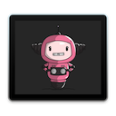

# desktop

Go/HTML/CSS/JS Desktop application scaffold.

[](https://github.com/machinebox/desktop/blob/master/icon.png)

## How it works

Build your application using Go APIs, and an HTML/CSS/JavaScript front-end
inside the `www` folder, just like a normal web root.

Building the package will generate a `.app` mac application file that will
host a simple web server serving the assets and any other endpoints you build.

When run, the application will open a web view into the `www` folder (and therefore
the `index.html` page).

## Usage

Build with: `make build`,
run with: `make run`

## Dependencies

* https://github.com/machinebox/appify - macOS Application Builder
* https://github.com/zserge/webview - Web view
* https://github.com/gobuffalo/packr - Asset packaging (puts JS/CSS/HTML files into the Go binary)

## Install

Use `make install` to run:

```
& go get github.com/machinebox/appify
$ go get github.com/jteeuwen/go-bindata/...
$ go get github.com/elazarl/go-bindata-assetfs/...
```

## Run

Run with `make run`.

To see log output open **Console** Application and search for `My Go Desktop App`
(or whatever your app ends up being called).


## Contribute?

We think this project could be much bigger. Got ideas? Get in touch.

## What next?

If you want to build other kinds of Go application, and have them built into
macOS applications, check out our [machinebox/appify](https://github.com/machinebox/appify)
project.
